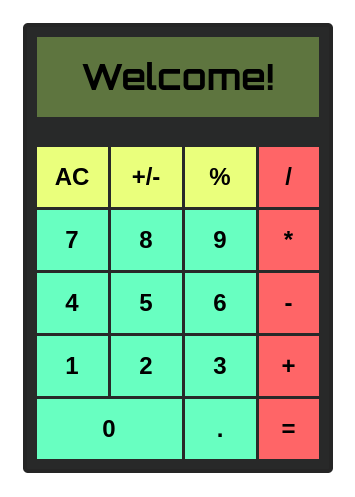

# calculator
Simple calculator exercise from The Odin Project.

## Screenshot

## Features

* Beautiful UI
* Decimal number operations
* Conversion from positive to negative and vice versa
* Basic operations and remainder supported
* Mouse input
* Data reset

## License
This code is under [MIT license](./LICENSE) requirements, so you are free to use it, distribute it at your own risk.